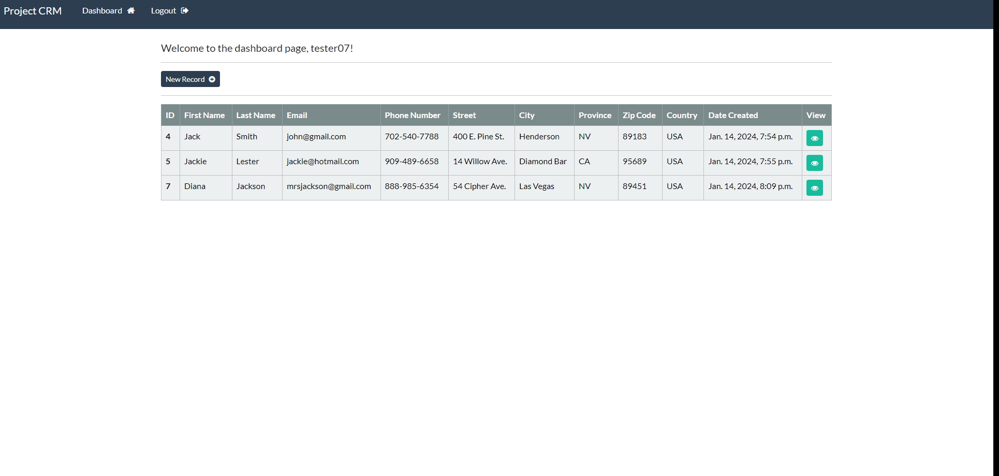
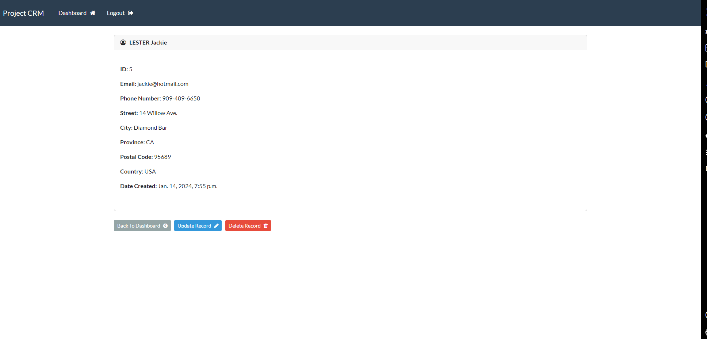
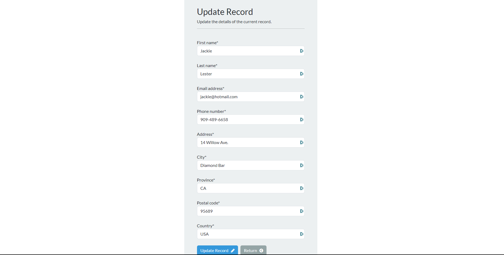
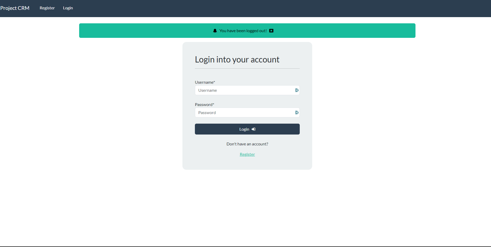

# Welcome to my Django Customer Records Management project which demonstrates CRUD.

Please ensure that you create your own virtual environment and install all the necessary packages via the requirements.txt file.

## Installation

1. Create a virtual environment:
   - On Unix/Linux/macOS: `python3 -m venv env`
   - On Windows: `py -m venv env`

2. Activate the virtual environment:
   - On Unix/Linux/macOS: `source env/bin/activate`
   - On Windows: `.\env\Scripts\activate`

3. Install the necessary dependencies: `pip install -r requirements.txt`

## Usage

Run the project with the command from the crm directory that contains the manage.py file: `python manage.py runserver`

